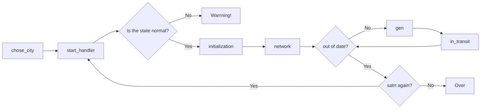

# Visualized Supply Chain System

## Introduction(简介)

- EN: This program visualizes the flow of goods in the supply chain system between warehouses and stores. 
On the right side of the graphical interface, there is a data dashboard that allows users to understand daily sales and out of stock situations. Users can adjust the initial inventory data of different levels of stores to understand whether inventory is sufficient.
This program requires reading the Excel sales data table of a specific template, and users can use the attached Excel file for testing.

- CN: 该程序可视化了供应链系统中货品在仓库以及门店中的流转过程。在图形界面的右侧有一个数据看板，可以了解每天的销售以及缺货情况，使用者可以调整不同级别的门店的库存初始数据，从而了解备货是否充足。该程序需要读取特定模板的Excel销售数据表，使用者可以使用附件的Excel文件进行测试。

## Design ideas(设计思路)

- EN: Firstly, I created a class called 'Spore', and all stores and stores are objects of this class. Its attributes include: soh (stock on hand), spaceX & spaceY (random coordinates in the canvas), neighbors (a dictionary used to record other nearby stores and distances), startsoh (initial inventory), in_transit (quantity of goods in transit to the store), trace (a dictionary used to record where goods sent to other stores have been shipped), and so on. The main class method is 'consume', which means deducting inventory when sales occur in the store.

- CN: 首先，我创建了一个名叫“Spore”的类，所有门店和店铺都是这个类的对象。它的属性包括：soh（门店的库存），spaceX 和 spaceY（在画布中的坐标，随机产生的），neighbors（一个字典，用来记录附近的其它门店及距离），startsoh (初始库存), in_transit (运往门店的在途货品数量)，trace（一个字典，用于记录发往其它门店的货品运到了哪里），等等。主要的类方法是consume，即在门店发生销售时扣减库存。

|序号|名称|类型|作用|
|:---|:---|:---|:---|
|1|soh|属性|记录当前库存情况|
|2|startsoh|属性|初始库存|
|3|spaceX|属性|在画布中的横坐标|
|4|spaceY|属性|在画布中的纵坐标|
|5|rank|属性|店铺级别，由小到大依次为Embryo, Baby, Basic, Anchor, Star, Super Star，用数字0-5表示|
|6|neighbors|属性|一个字典，用来记录附近的其它门店及距离|
|7|trace|属性|一个字典，用于记录发往其它门店的货品运到了哪里|
|8|sales|属性|一个列表，用于记录每日销售|
|9|consume|方法|用于扣减店存|
|10|absorb|方法|用于增加库存|
|11|record_sales|方法|用于记录每日销售|

- EN: The logic of the entire system operation is that the store generates sales based on the read data. When it is out of stock, the warehouse or its neighboring stores will replenish it. After the user selects a city, the "initialization" function initializes the corresponding "Spore" object, and the "network" function updates the "neighbors" attribute based on the object's location. Afterwards, the 'gen' function is used to update the daily inventory of the warehouse and all stores. This function calls a function called "in_transit" to update the replenishment between the store and warehouse. The function needs to fill in a parameter called "step" to control the delivery speed, which I set to 60 during testing. After the read sales data is traversed, the simulation process of the program ends. The user can switch cities, modify the inventory quantity in "setting", and run again.

- CN: 整个系统运作的逻辑是，门店基于读取的数据产生销售，当它缺货时，仓库或者其邻近的店铺会向它补货。在使用者选择了城市以后，“initialization”函数会初始化对应的“Spore”对象，“network”函数会根据对象的位置更新“neighbors”属性。之后，"gen"函数被用来更新仓库和所有门店每一天的库存。该函数调用一个名为“in_transit”的函数，更新门店与仓库之间的补货，该函数需要填入一个名为"step"的参数，用来控制送货的速度，我在测试时设置了60。当读取的销售数据被遍历完以后，程序的模拟过程结束，使用者可以切换城市，在“setting”中修改库存数量后再次运行。

- EN: When creating a data dashboard, I used a tab container (Notebook). When the 'gen' function runs, daily sales and out of stock data is recorded in a list, which is then read by the function responsible for visualization. These functions dynamically adjust the spacing and height of the column chart based on the length of the list and the size of the data (see functions "show_sales", "show_oos", "show_oos_by_type" for details), thereby obtaining a dynamic data dashboard.

- CN: 制作数据看板时，我使用了选项卡容器（Notebook）。当“gen”函数运行时，每天的销售和缺货数据会被用列表记录下来，然后列表被负责可视化的函数读取。这些函数会根据列表的长度、数据的大小动态调整柱形图的间距、高度（详见于函数“show_sales”，“show_oos”，“show_oos_by_type”），从而获得动态的数据看板。

## Areas for Improvement

- EN: The further idea is to enable this system to automatically open and close stores based on regional sales.
- CN: 进一步的设想是让这个系统具备根据区域销售自动开店和关店的能力。
